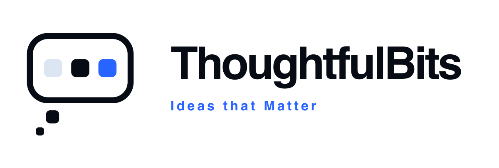
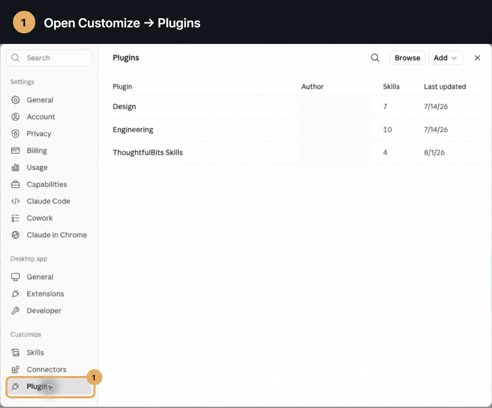
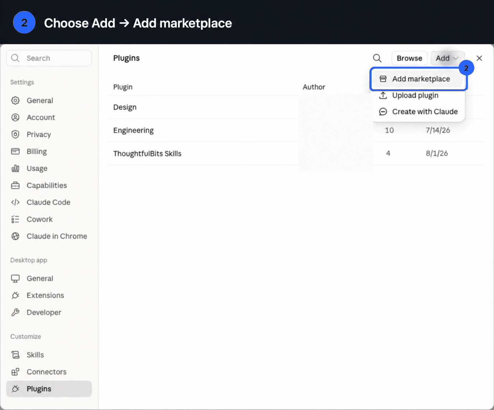
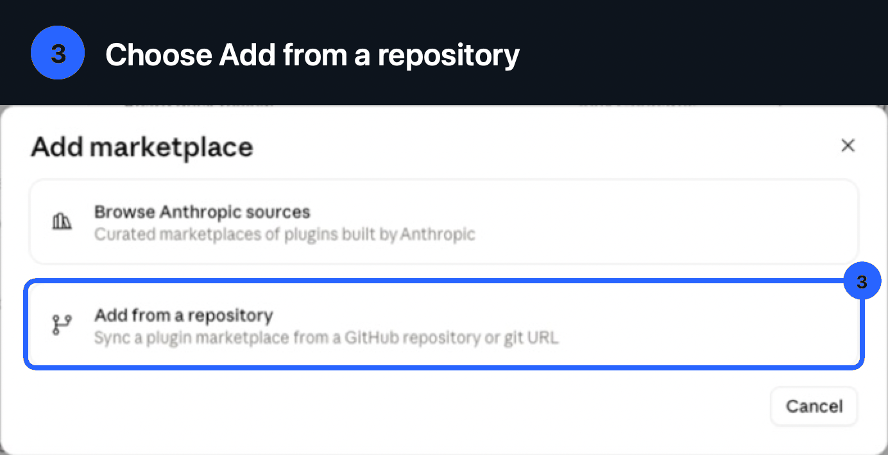
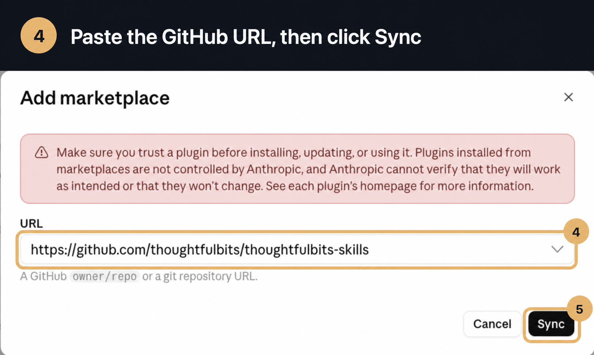
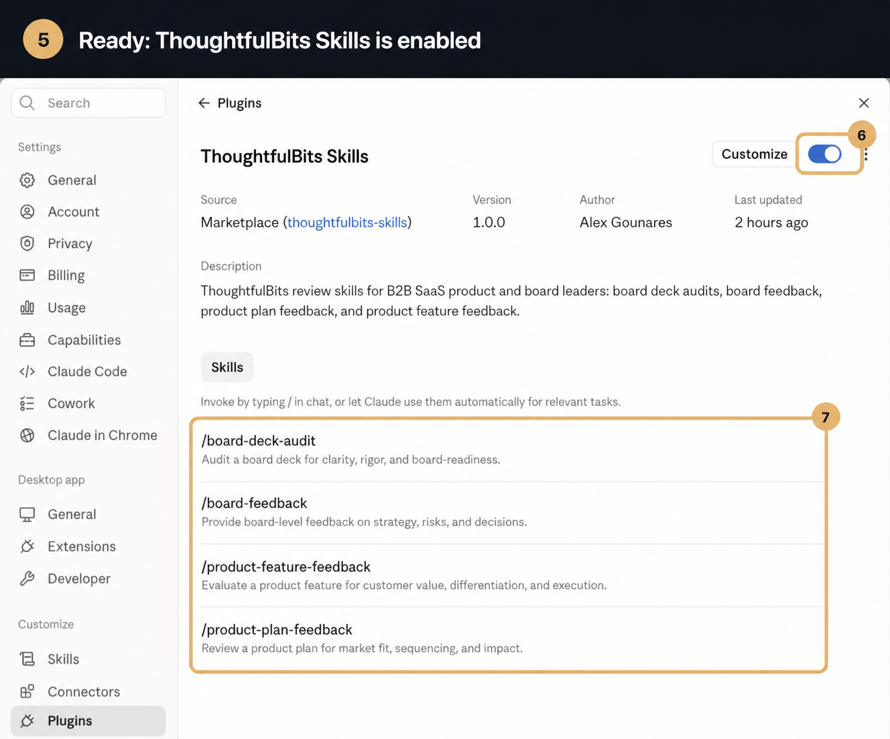

# ThoughtfulBits Skills — review skills for ChatGPT, Codex, and Claude

Four review skills for B2B SaaS product and board leaders, packaged as a native OpenAI plugin and a Claude Desktop plugin:

| Skill | Use it when you want… |
| --- | --- |
| **board-deck-audit** | A deep, structured pre-send audit of a board deck: claim ledger, reconciled math, evidence grading, and a prioritized fix list |
| **board-feedback** | The concise reaction a sharp director would give: does this deck make sense? One screen, no tables |
| **product-plan-feedback** | A product plan, roadmap, launch plan, or GTM plan graded against a key-milestone rubric |
| **product-feature-feedback** | A single feature or product scored with the [SPARK method](https://www.thoughtfulbits.me/p/boring-apps-add-some-spark): Simple, Purposeful, Attractive, Reliable, Known |

Attach your material as `.pptx`, `.pdf`, `.docx`, `.md`, or pasted text, and ask in plain language — the right skill triggers from what you ask for. PowerPoint speaker notes are included when the host exposes them to the skill.

## Install in ChatGPT Work or Codex

Open [ThoughtfulBits Skills in the OpenAI Plugins Directory](https://chatgpt.com/plugins/plugins_6a6f44be6a5881919d952d77e2da8080), select the plus button to install it, and start a new chat. Type `@` to choose the plugin or a specific skill explicitly, or ask for the outcome directly and let ChatGPT select the matching skill.

OpenAI plugins currently work in:

- **ChatGPT Work** on the web
- **ChatGPT Work** or **Codex** in the ChatGPT desktop app
- **Codex CLI**, through `/plugins`

They are not currently available in ordinary ChatGPT Chat, the IDE extension, or mobile. See OpenAI's [plugin availability guide](https://learn.chatgpt.com/docs/plugins) for the current surfaces.

### Test the OpenAI package locally

The native package manifest is `.codex-plugin/plugin.json`. Build the exact skills-only submission ZIP with:

```bash
./scripts/build-openai-plugin.sh
```

The command validates the Claude and OpenAI manifests, all four skills, their ChatGPT metadata, the listing URLs, and the branding assets before writing the ZIP to `dist/`. The checked-in [submission packet](docs/openai-submission.md) contains the directory copy, five positive tests, three negative tests, and release notes.

## Install in Claude Desktop

No terminal is required. Add the public GitHub repository to Claude Desktop as a plugin marketplace:

1. Open Claude Desktop. In the left sidebar, choose **Customize**, then **Plugins**.

   

2. Click **Add**, then choose **Add marketplace**.

   

3. Choose **Add from a repository**.

   

4. Paste this public GitHub URL, then click **Sync**:

   ```text
   https://github.com/thoughtfulbits/thoughtfulbits-skills
   ```

   

5. Claude adds and enables **ThoughtfulBits Skills**. Confirm that its toggle is on.

   

That is the entire installation. Start a new Claude Desktop chat, attach your material, and ask.

## The four skills

### board-deck-audit

The last tough, constructive reader before the board sees the deck. It renders every slide (including charts and speaker notes), builds a claim ledger, recalculates the math the deck asks the board to accept, grades every explanation's evidence, and separates decisions from FYIs — then delivers a full report with a verdict and a must-fix / should-improve / prepare-to-answer action list.

> "Our Q3 board meeting is Thursday — audit this deck before I send it."

> "Pressure-test this board deck like a tough board member. Anything in here that gets us grilled?"

> "Compare this quarter's deck with the prior board pack and tell me whether we're grading ourselves honestly."

### board-feedback

The quick read. It answers one question — *does this deck make sense?* — the way an experienced director would after reading the pre-read the night before the meeting: an overall reaction, what directors will say in the room, the questions you'll get, and a makes-sense verdict. One screen, no audit tables. When the deck needs the deep pass, it says so and points to board-deck-audit.

> "Gut check before I polish this any further — does this deck make sense?"

> "If you were on my board, what would you say in the meeting?"

### product-plan-feedback

Grades a product plan against a key-milestone rubric: a strategy simple enough to repeat without you in the room that solves a problem customers already know they have; explicit executors, beneficiaries, and champions; a roadmap that makes value visible and shareable; weekly-improving metrics; design-partner go/no-go hurdles; an into-orbit GTM funnel; positioning, competitors, and pricing tiers. Scoped to the document — a roadmap-only doc is not failed for omitting GTM.

> "Review our FY27 product plan before the offsite. Where does it fall short?"

> "This is only our H2 roadmap — review it against your product-plan standards."

### product-feature-feedback

Scores a single feature or product 1–5 on each SPARK dimension — **S**imple, **P**urposeful & Prioritized, **A**ttractive & Attentive, **R**eliable, **K**nown — with cited evidence, then recommends the cut list, one delight moment to design, and the three simplest improvements. 25 is optimal; 18–24 calls for focused iteration; below 18 means halt new features and rebuild foundations.

> "SPARK-score this feature spec before we commit the quarter to it."

> "Why does our app feel boring? Run your SPARK review on it."

## Upgrading from board-deck-review

This plugin was previously published as **Board deck review** (`board-deck-review`). The old GitHub URL redirects here, so an already-added marketplace keeps syncing; after the next sync, enable **ThoughtfulBits Skills** and remove the defunct **Board deck review** entry. If the sync doesn't pick up the rename, remove the marketplace and re-add it at the URL above.

## Repo layout

```
skills/<skill-name>/SKILL.md   # the four skills
skills/<skill-name>/agents/    # ChatGPT and Codex display/invocation metadata
.codex-plugin/                 # native OpenAI plugin manifest
.claude-plugin/                # Claude Desktop plugin marketplace manifests
assets/                        # OpenAI directory branding
evals/<skill-name>/            # per-skill eval suites and fixtures
docs/images/                   # install walkthrough screenshots
scripts/                       # OpenAI package validation and ZIP builder
```

## Brand assets

The plugin uses the ThoughtfulBits cobalt, ink, platinum, and frost-white identity. Its speech-bubble symbol holds three distinct “bits,” with a two-bit thought tail. OpenAI-specific light- and dark-mode directory and composer icons are stored in `assets/openai/`; `assets/logo.png` and `assets/icon.svg` remain the native manifest defaults.

## Releasing

The `Release plugin` GitHub Actions workflow runs on every push to `main`. It validates that `.codex-plugin/plugin.json`, `.claude-plugin/plugin.json`, and the plugin entry in `.claude-plugin/marketplace.json` declare the same name and semantic version, then creates and pushes the annotated release tag:

```text
thoughtfulbits-skills--v<version>
```

If the version in the manifests has not been released yet, the workflow tags it as-is. Otherwise it increments the patch component in all three manifests, commits the version bump to `main`, and tags that commit. A rerun against an already-tagged release is a successful no-op.

To choose a new minor or major version, update the version in all three manifests before pushing. Because automatic patch releases add a version-bump commit to `main`, pull or rebase before your next push.
