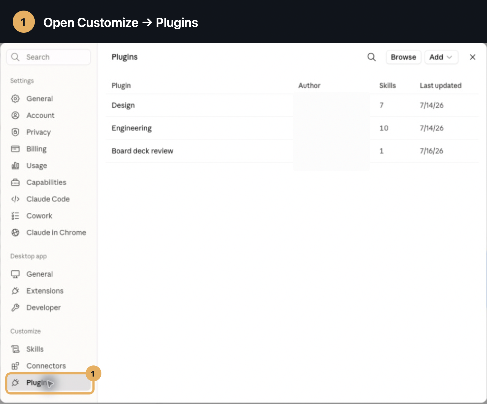
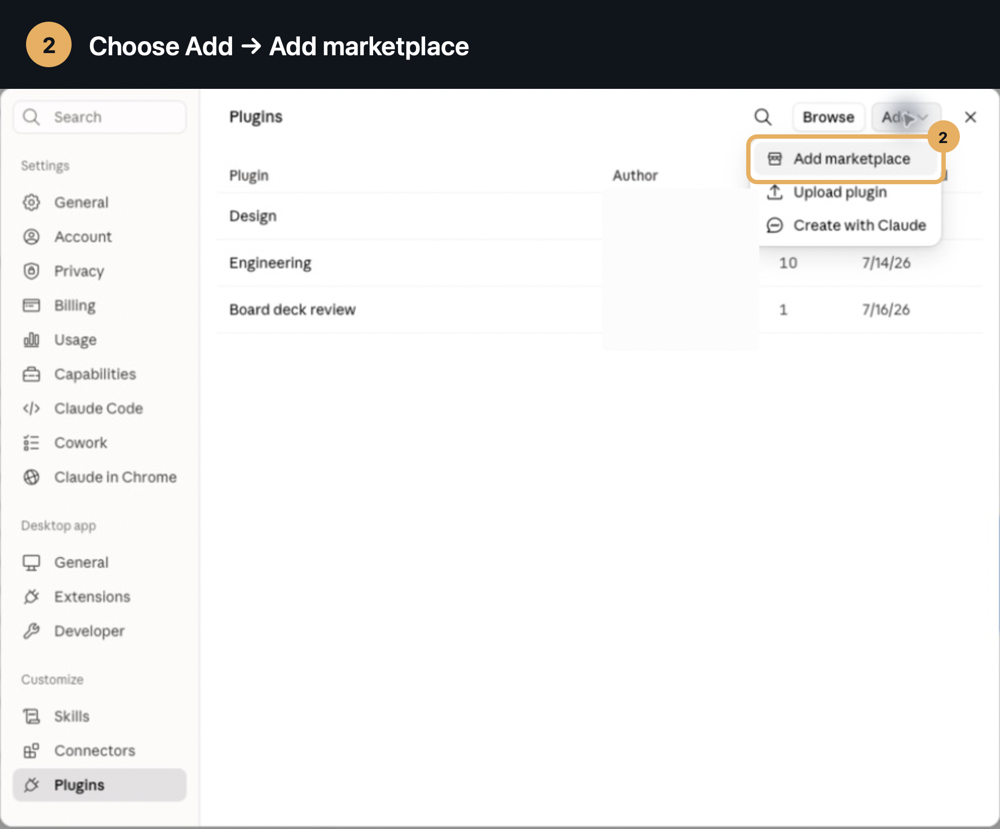
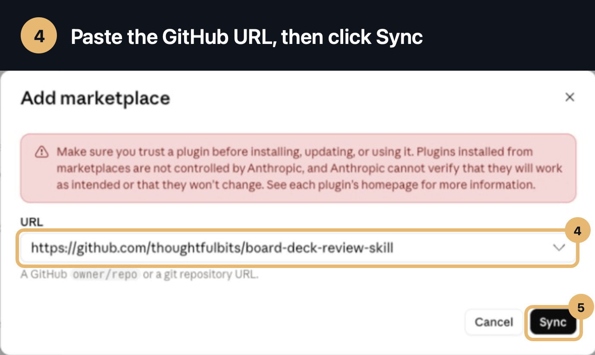
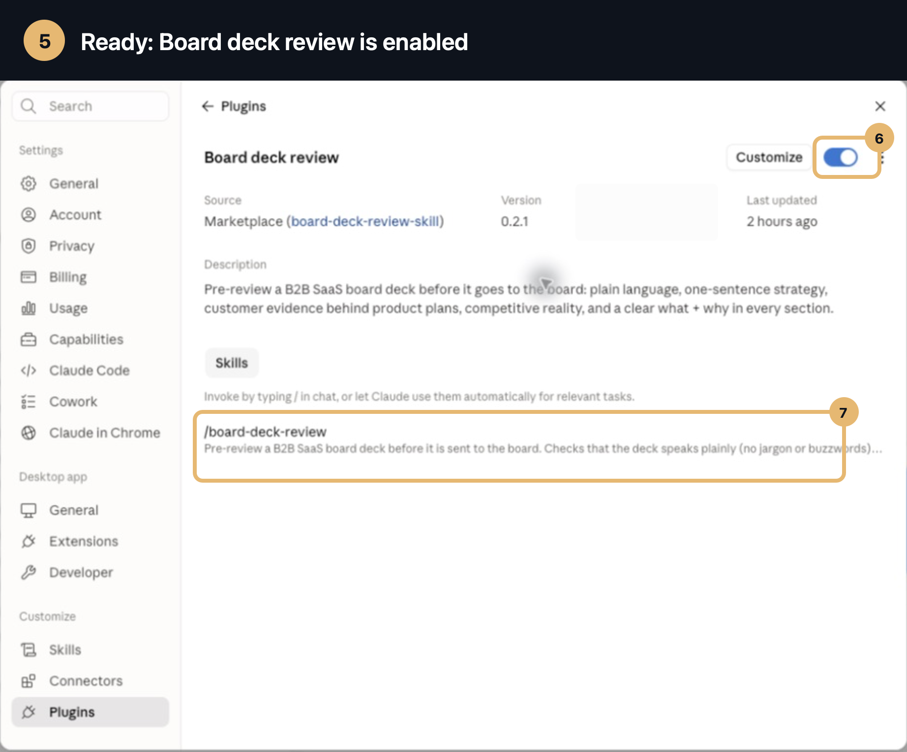

# Board Deck Review — a Claude Desktop plugin

Installs a board-specific review skill in Claude Desktop. Point Claude at your B2B SaaS board deck (`.pptx`, `.pdf`, `.docx`, `.md`, or pasted text) and it reviews the material the way your toughest constructive board member would — then tells you exactly what to fix before the board sees it.

## Install in Claude Desktop

No terminal is required. Add the public GitHub repository to Claude Desktop as a plugin marketplace:

1. Open Claude Desktop. In the left sidebar, choose **Customize**, then **Plugins**.

   

2. Click **Add**, then choose **Add marketplace**.

   

3. Choose **Add from a repository**.

   

4. Paste this public GitHub URL, then click **Sync**:

   ```text
   https://github.com/thoughtfulbits/board-deck-review-skill
   ```

   

5. Claude adds and enables **Board deck review**. Confirm that its toggle is on.

   

That is the entire installation. Start a new Claude Desktop chat, attach your deck, and ask:

> "Review this board deck before it goes out. Tell me what to fix."

## What it checks

1. **Pre-read and visual clarity** — renders the slides, reads speaker notes, and checks that chart axes, labels, footnotes, and takeaways support what the slide claims.
2. **Strategy spine and coherence** — tests the plain customer-pain/solution sentence, then checks whether product, GTM, hiring, and budget choices actually reinforce it.
3. **Quantitative reconciliation** — recalculates runway, totals, percentages, periods, denominators, plan-vs.-actual results, and cross-slide assumptions instead of accepting stated math at face value.
4. **Evidence and causality** — separates unsupported claims, anecdotes, quantified patterns, and validated causes. Correlation does not silently become causation.
5. **Customer evidence behind product plans** — asks what customers did or said, how broad the evidence is, and what proof point comes next. TAM projections alone do not count.
6. **Competitive reality** — checks competitors and alternatives against win/loss, pricing, sales-cycle, churn, and product evidence elsewhere in the deck.
7. **What, why, evidence, and response** — every material result needs a real cause, supporting evidence, an owner, timing, and a success measure.
8. **Accountability, forecasts, and risk** — grades commitments when prior materials are supplied and tests future assumptions, downside cases, mitigations, and change-course triggers.
9. **Cash and decision readiness** — reconciles burn and runway, then separates decisions, advice, help, and FYI so every approval ask is actually decidable.
10. **Actionable recommendations** — classifies each fix as a deck edit, analysis required, or decision preparation and ranks it as must fix, should improve, or prepare to answer.

The output is a structured report with a verdict, board-level takeaways, decision-readiness table, material findings, quantitative reconciliation, section-by-section evidence analysis, the questions the board will ask, and a prioritized action list. It does not create a review file unless you ask for one.

## Use

Start a new Claude Desktop chat, attach your deck, and ask:

> "Our Q3 board meeting is Thursday — review this board deck before I send it."

> "Pre-review this board deck like a tough board member. Anything in here that gets us grilled?"

> "Compare this quarter's deck with the prior board pack and tell me whether we're grading ourselves honestly."

The skill is deliberately board-specific. General fundraising and investor updates use different disclosure and decision standards and are outside its trigger unless they are explicitly board materials.

## Repo layout

```
skills/board-deck-review/SKILL.md   # the skill
.claude-plugin/                     # Claude Desktop plugin marketplace manifests
evals/                              # Markdown and PowerPoint fixtures plus behavioral expectations
```
